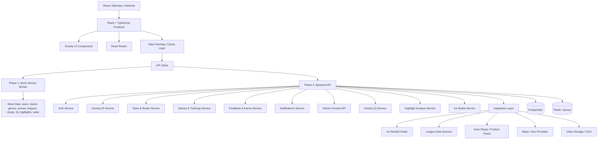
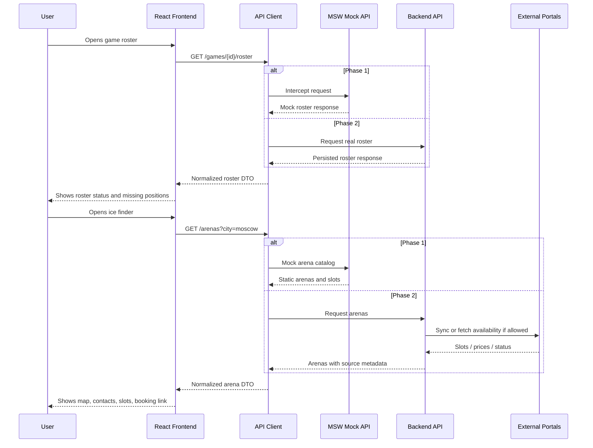

# Этап 4. Высокоуровневый план системы

## Цель этапа

Сформировать системный план MVP социальной сети для хоккеистов-любителей с двухэтапной разработкой:

1. **Phase 1: Frontend-first MVP** - React-приложение на моках, демонстрирующее пользовательские сценарии, продуктовую логику и UX без реального backend.
2. **Phase 2: Backend & Integrations** - подключение API, базы данных, авторизации, реальных интеграций с ареной льда, лигами и магазинами.

План нужен как основа для будущей детализации в Spec: функциональные требования получают стабильные идентификаторы `FR-01`, `FR-02` и далее.

## Входные продуктовые приоритеты

Ключевые пункты из предыдущих этапов:

- **Hockey ID**: единый профиль игрока с амплуа, уровнем, районом, доступностью и историей участия.
- **Smart Roster**: управление составом на игру или тренировку: кто идет, кто отказался, кого нужно добрать.
- **Goalkeeper SOS**: быстрый поиск вратаря как отдельный критичный сценарий.
- **Ice Finder Light**: карта ледовых арен Москвы с контактами, ссылками и, позднее, слотами аренды.
- **Game Feedback & Karma**: подтверждение участия, оценка надежности и уровня игрока.
- **League Visibility**: отображение любительских лиг, команд, расписания и базовой статистики.
- **Gear Integration Light**: справочник магазинов, переходы на сайт, цены/наличие при наличии feed/API.

## Предлагаемый стек

- **Frontend**: `React`, `TypeScript`, `Vite`.
- **UI Kit**: `Gravity UI`.
- **Routing**: `React Router`.
- **State / Data fetching**: `TanStack Query` или аналогичный слой для query/cache.
- **Mock API**: `Mock Service Worker (MSW)`.
- **Forms**: `React Hook Form` или легкий form-layer, совместимый с Gravity UI.
- **Maps**: `Yandex Maps` или другой провайдер карт, совместимый с российским рынком.
- **Testing frontend**: `Vitest`, `React Testing Library`, `Playwright` для ключевых сценариев.
- **Phase 2 backend candidate**: `Node.js + TypeScript`, `NestJS` или `Fastify`, `PostgreSQL`, `Redis` для очередей/кэша, OpenAPI-контракты.

## Phase 1: Frontend-first MVP на моках

Цель: быстро проверить продуктовые сценарии, UX и навигацию без зависимости от реальных API.

Основные принципы:

- Все экраны работают через единый `api client`, но ответы перехватываются `MSW`.
- Моки моделируют реальные состояния: пустые списки, занятый лед, срочный поиск вратаря, разные уровни игроков, ошибки интеграций.
- Структуры mock data должны быть близки к будущим DTO, чтобы при переходе на backend не переписывать UI.
- Внешние интеграции показываются как read-only справочники или simulated API responses.
- Внешние CTA (запись на лёд, покупка, сайт лиги/магазина) на Phase 1 **не ведут на мёртвые URL** — открывают in-app mock-flow (`SPEC-FR-6.4.1`).

Результаты Phase 1:

- Кликабельный MVP для демонстрации инвесторам, партнерам, капитанам и игрокам.
- Проверенная навигационная модель.
- Уточненный список требований и DTO для backend.
- Список интеграционных рисков по аренам, лигам и магазинам.

## Phase 2: Backend, данные и интеграции

Цель: заменить mock layer реальными сервисами, хранением данных и интеграциями.

Основные принципы:

- Frontend сохраняет те же API-контракты, которые использовались в Phase 1.
- Backend предоставляет versioned API, например `/api/v1`.
- Интеграции с внешними порталами изолируются в отдельных adapter-сервисах.
- Данные с ненадежных источников помечаются метаданными: `source`, `updatedAt`, `confidence`, `syncStatus`.
- Для порталов без API используется промежуточная стратегия: ручная админка, партнерский импорт, CSV/XML, либо controlled scraping только при юридической допустимости.

Результаты Phase 2:

- Реальная регистрация и авторизация.
- Хранение профилей, команд, игр, откликов и отзывов.
- Подключение первых партнерских источников льда, лиг или магазинов.
- Админка для ручной модерации данных и внешних источников.

## Модули системы

| Модуль | Назначение | Phase 1 | Phase 2 |
| :--- | :--- | :--- | :--- |
| `Auth & Onboarding` | Вход, первичная настройка профиля, выбор роли | Mock login, mock user session | Реальная авторизация, сессии, роли |
| `Hockey ID` | Профиль игрока, амплуа, уровень, район, доступность | Mock profile CRUD | Persisted profile, privacy settings |
| `Team & Roster` | Команды, составы, посещаемость, добор игроков | Mock teams and events | Team service, invitations, roster state |
| `Goalkeeper SOS` | Срочный поиск вратаря | Mock alerts and responses | Notifications, matching, availability |
| `Games & Trainings` | Игры, тренировки, календарь, участие | Mock event feed | Event service, participation records |
| `Ice Finder` | Карта арен, слоты, контакты, ссылки на бронирование | Static/mock arena catalog | Arena adapters, availability sync |
| `Leagues` | Лиги, команды, расписания, таблицы, статистика | Mock league pages | League import adapters, moderation |
| `Gear & Shops` | Магазины, товары, цены, наличие, переходы | Mock catalog cards | Partner feeds/API, affiliate tracking |
| `Feedback & Karma` | Отзывы, надежность, подтверждение уровня | Mock post-game feedback | Reputation service, anti-abuse rules |
| `Notifications` | Push/email/in-app уведомления | Mock notification center | Real push/email/Telegram/VK notifications |
| `Admin Console` | Управление справочниками и интеграциями | Optional prototype | Real moderation and data operations |
| `Design System` | Хоккейная визуальная система, темы, motion, domain-компоненты | Токены + ключевые паттерны на Gravity UI | Расширение тем, a11y-аудит, brand kit |
| `Hockey IQ` | Мини-тесты по правилам, тактике и хоккейным ситуациям | Mock quiz catalog, attempt flow, leaderboard | Rule/tactics content CMS, anti-cheat, seasonal ratings |
| `Highlight Analysis` | Загрузка коротких моментов, разметка стрелками и комментарии | Mock upload, local preview, annotation JSON | Video storage, transcoding, signed URLs, coach comments |
| `Ice Radar` | Персональные рекомендации «что сделать сегодня» | Mock recommendation cards from existing events/SOS/arenas | Recommendation service, geo/time matching, notification triggers |

## Расширения продукта: возвращающие сценарии

Новые функции выбраны как next-release/MVP-extension, потому что они добавляют причины возвращаться в приложение между играми, а не только в день матча.

| Модуль | Сценарий | Стек Phase 1 | Потенциальные интеграции Phase 2 |
| :--- | :--- | :--- | :--- |
| `Hockey IQ` | Игрок проходит короткий тест, получает очки, серию и место в рейтинге. | `React + TS`, `Gravity UI`, `TanStack Query`, `MSW` для вопросов, попыток и leaderboard. | CMS/админка вопросов, античит, сезонные рейтинги, партнерские призы. |
| `Highlight Analysis` | Игрок загружает короткий момент, ставит паузу, рисует стрелки и получает комментарии. | Mock upload без реального файла: DTO момента, annotation layer, comments. | S3/Object Storage, CDN, video transcoding, signed upload URL, moderation, coach accounts. |
| `Ice Radar` | Система собирает релевантные подсказки: ближайший лёд, SOS, игра по району, попутчик. | Mock recommendations, собранные из существующих `events`, `arenas`, `recruitment-requests`. | Геолокация, маршруты, push, персональный ranking model, интеграции карт. |

### Потоки данных новых функций

#### Hockey IQ

1. Пользователь открывает `IQ Tests`.
2. Frontend запрашивает `/iq-tests` и показывает тесты по правилам, тактике и игровым ситуациям.
3. Пользователь отвечает на вопросы; frontend отправляет `POST /iq-attempts`.
4. Mock API возвращает результат: score, правильные ответы, пояснения и место в leaderboard.
5. В Phase 2 результаты сохраняются в backend, а вопросы управляются через content/admin pipeline.

#### Highlight Analysis

1. Пользователь открывает `Moments` и создает `Highlight`.
2. Phase 1 сохраняет mock metadata: событие, автор, preview, длительность, статус загрузки.
3. Annotation layer хранит JSON: timestamp, стрелки, зоны, текстовые комментарии.
4. Команда или тренер оставляет комментарии к моменту.
5. В Phase 2 видео уходит в storage/transcoding, а frontend работает по signed URLs.

#### Ice Radar

1. Пользователь открывает `Ice Radar` или видит виджет в правом борту.
2. Frontend запрашивает `/radar/recommendations`.
3. Mock API агрегирует рекомендации из существующих событий, SOS и слотов льда.
4. Пользователь кликает рекомендацию и переходит в событие, SOS или арену.
5. В Phase 2 backend ранжирует рекомендации по роли, району, времени, доступности и истории участия.

## Дизайн-система и UX-принципы

### Бренд-концепции (выбор для MVP)

Базовая формула: **«Locker Room» (раздевалка)** для доверия и состава + акценты **«Power Play»** для SOS и срочных событий + фоновая эстетика **«Ice & Energy»** в hero и маркетинговых блоках.

Слоган UX: *«Раздевалка, в которой доверяют, и табло, которое не врёт»*.

### Визуальная метафора и иммерсивность

Для создания «супервдохновляющего» дизайна в 2026 году мы используем подход **Immersive Storytelling** и **Scroll-Driven UI**.

| Элемент | Метафора | Реализация |
| :--- | :--- | :--- |
| **Скролл-сторителлинг** | Движение по льду | Использование `GSAP ScrollTrigger` для управления камерой и появления контента. |
| **3D Якоря** | Снаряжение и Арены | Интеграция `Spline` или `Three.js` для интерактивных 3D-моделей (шайба, шлем, каток). |
| **Bento Dashboards** | Тактическая доска | Модульные сетки (Bento Grids) для профиля игрока и матч-центра. |
| **Типографика** | Заголовки табло | Крупные акцидентные шрифты с анимацией начертания (Variable Fonts). |
| **Smooth Flow** | Скольжение | Мягкий скролл (`Lenis`) для премиального ощущения от интерфейса. |

### Палитра (design tokens, ориентир)

| Token | Значение | Роль |
| :--- | :--- | :--- |
| `--hockey-ice-deep` | `#0B1F3A` → `#1A4D6E` | Тёмная тема, лёд |
| `--hockey-line-red` | `#E10600` | SOS, CTA, красная линия |
| `--hockey-locker-warm` | `#F4F1EA` | Светлая тема, раздевалка |
| `--hockey-board-gold` | `#FFD700` | High karma, MVP |
| `--hockey-rink-mist` | `#C8D6E5` | Вторичный текст, границы |

Токены накладываются поверх CSS variables Gravity UI (`ThemeProvider`), без форка компонентов.

### Gravity UI: стратегия кастомизации

- **Уровень 1 (MVP):** `ThemeProvider` + глобальные CSS variables + обёртки (`HockeyButton`, `IceCard`, `ScoreboardLoader`).
- **Уровень 2:** кастомные варианты `Label` по амплуа (вратарь / защита / нападение).
- **Уровень 3 (Post-MVP):** опциональные sound/haptic для SOS (выключены по умолчанию).

Переопределяемые компоненты:

| Gravity UI | Хоккейный паттерн | SPEC-UI |
| :--- | :--- | :--- |
| `Button` | Шайба-CTA, красная лампа для SOS | `SPEC-UI-1.1`, `SPEC-UI-1.2` |
| `Card` | Ледовая плитка с highlight-гранью | `SPEC-UI-1.3` |
| `Label` | Нашивка амплуа / статус лиги | `SPEC-UI-1.4` |
| `Progress` | Полоска заполненности состава | `SPEC-UI-2.4` |
| `Tabs` | Смена звеньев, индикатор-шайба | `SPEC-UI-4.2` |
| `Loader` / Skeleton | Бегущая строка табло | `SPEC-UI-3.1` |
| `Table` (custom) | Турнирное табло с LED-цифрами и медалями | `SPEC-UI-2.7` |

### Domain-паттерны экранов

```
DESKTOP (поле)
┌─────────┬──────────────────┬──────────┐
│  NAV    │  МАТЧ-ЦЕНТР      │  БОРТ    │
│         │  лента / события │  SOS     │
└─────────┴──────────────────┴──────────┘

MOBILE (одна смена)
┌─────────────┐
│  контент    │  ← swipe = смена звена / статус участия
│  [bottom nav + SOS FAB]
└─────────────┘
```

- **Карточка игрока** — коллекционная hockey card (`SPEC-UI-2.1` → `SPEC-FR-2.3.1`).
- **Команда** — раздевалка со шевроном и слотами по позициям (`SPEC-UI-2.3` → `SPEC-FR-3.2.1`).
- **Лента / события** — матч-центр, не social feed (`SPEC-UI-2.5` → `SPEC-FR-4.1.1`, `SPEC-FR-5.2.1`).
- **Календарь** — расписание как табло (`SPEC-UI-2.6` → `SPEC-FR-4.2.1`).
- **Катки** — ледовые плитки + зелёная «лампа» свободного слота (`SPEC-UI-2.2` → `SPEC-FR-6.2.1`).
- **Турнирная таблица** — табло арены: шапка «STANDINGS», LED-столбцы И/В/П/О, медали топ-3, золотой лидер, полоска очков (`SPEC-UI-2.7` → `SPEC-FR-7.2.1`).
- **Расписание лиги** — строки матч-центра хозяева — гости (`SPEC-UI-2.8` → `SPEC-FR-7.2.1`).

### Motion-принципы

- Длительность UI-transition: **180–220 ms**, easing «бросок» (ease-out).
- Анимации только на **действиях с последствием** (SOS, участие, бронирование, karma).
- Красная пульсация — **только** Goalkeeper SOS (`SPEC-UI-4.3`).
- Уважение `prefers-reduced-motion`: отключение decorative animation (`SPEC-UI-5.3`).

### Phase 1 vs Phase 2

| Аспект | Phase 1 | Phase 2 |
| :--- | :--- | :--- |
| Темы | Light + Dark tokens | User preference persist |
| Звук свистка | Off by default, optional | Push + optional sound |
| Матч-центр | Mock-лента на EventsPage | Real-time activity feed |
| Шевроны команд | Генерация из названия + района | Upload custom crest |

Детальные требования: `docs/05-srs.md`, раздел **16. UI/UX (`SPEC-UI-*`)**.

## Идентификаторы функциональных требований

| ID | Требование | Основной модуль | Приоритет MVP |
| :--- | :--- | :--- | :--- |
| `FR-01` | Пользователь может пройти onboarding и выбрать роль: игрок, вратарь, капитан, организатор | `Auth & Onboarding` | Must |
| `FR-02` | Пользователь может создать и редактировать `Hockey ID`: имя, амплуа, уровень, район, доступность | `Hockey ID` | Must |
| `FR-03` | Пользователь может просматривать карточки других игроков с уровнем, амплуа и рейтингом надежности | `Hockey ID` | Must |
| `FR-04` | Капитан может создать команду и управлять базовым составом | `Team & Roster` | Must |
| `FR-05` | Капитан может создать игру/тренировку с датой, временем, ареной, уровнем и нужными слотами | `Games & Trainings` | Must |
| `FR-06` | Игрок может отметить участие: идет, не идет, под вопросом | `Team & Roster` | Must |
| `FR-07` | Капитан видит статус состава и дефицитные позиции по событию | `Team & Roster` | Must |
| `FR-08` | Капитан может запустить запрос на добор игрока или вратаря | `Goalkeeper SOS` | Must |
| `FR-09` | Вратарь может видеть срочные запросы и откликаться на них | `Goalkeeper SOS` | Must |
| `FR-10` | Пользователь может просматривать календарь своих игр и тренировок | `Games & Trainings` | Must |
| `FR-11` | Пользователь может открыть карту/список ледовых арен Москвы | `Ice Finder` | Must |
| `FR-12` | Пользователь может видеть карточку арены: адрес, контакты, удобства, ссылка на бронирование | `Ice Finder` | Must |
| `FR-13` | Система может показывать mock/free slots для арены в Phase 1 и real slots в Phase 2 при наличии источника | `Ice Finder` | Should |
| `FR-14` | Пользователь может просматривать список любительских лиг и карточку лиги | `Leagues` | Should |
| `FR-15` | Пользователь может видеть расписание, таблицу или статистику лиги, если данные доступны | `Leagues` | Should |
| `FR-16` | Пользователь может оставить post-game feedback по явке, уровню и адекватности участника | `Feedback & Karma` | Must |
| `FR-17` | Система рассчитывает базовый показатель надежности игрока на основе подтвержденных участий и отзывов | `Feedback & Karma` | Should |
| `FR-18` | Пользователь может просмотреть магазины экипировки и перейти на сайт партнера | `Gear & Shops` | Could |
| `FR-19` | Пользователь может сравнить цену/наличие товара, если магазин предоставляет feed/API | `Gear & Shops` | Could |
| `FR-20` | Пользователь получает in-app уведомления о доборе, изменении состава и событиях | `Notifications` | Must |
| `FR-21` | Администратор может вручную добавлять или редактировать арены, лиги, магазины | `Admin Console` | Should |
| `FR-22` | Администратор может видеть статус внешних источников данных: synced, failed, stale, manual | `Admin Console` | Should |
| `FR-23` | Система хранит источник и время обновления для внешних данных | `Integration Layer` | Should |
| `FR-24` | Система разделяет mock API и real API без изменения пользовательских сценариев frontend | `Frontend Platform` | Must |
| `FR-25` | Пользователь может открыть каталог `Hockey IQ` тестов по правилам и тактике | `Hockey IQ` | Could |
| `FR-26` | Пользователь может пройти `Hockey IQ` тест и получить score, пояснения и серию | `Hockey IQ` | Could |
| `FR-27` | Система показывает leaderboard `Hockey IQ` среди игроков | `Hockey IQ` | Could |
| `FR-28` | Пользователь может создать mock-момент для разбора, связанный с игрой или командой | `Highlight Analysis` | Could |
| `FR-29` | Пользователь может добавить разметку момента: стрелки, зоны, timestamp и комментарий | `Highlight Analysis` | Could |
| `FR-30` | Капитан или тренер может оставить комментарий к моменту | `Highlight Analysis` | Could |
| `FR-31` | Система явно разделяет mock-разбор моментов и реальную video upload интеграцию | `Highlight Analysis` | Should |
| `FR-32` | Система показывает персональные рекомендации `Ice Radar` на сегодня | `Ice Radar` | Should |
| `FR-33` | Пользователь может скрыть рекомендацию или перейти в связанный сценарий | `Ice Radar` | Should |

## Таблица соответствия «Модуль -> ID требований»

| Модуль | ID требований |
| :--- | :--- |
| `Auth & Onboarding` | `FR-01` |
| `Hockey ID` | `FR-02`, `FR-03` |
| `Team & Roster` | `FR-04`, `FR-06`, `FR-07` |
| `Goalkeeper SOS` | `FR-08`, `FR-09` |
| `Games & Trainings` | `FR-05`, `FR-10` |
| `Ice Finder` | `FR-11`, `FR-12`, `FR-13` |
| `Leagues` | `FR-14`, `FR-15` |
| `Gear & Shops` | `FR-18`, `FR-19` |
| `Feedback & Karma` | `FR-16`, `FR-17` |
| `Notifications` | `FR-20` |
| `Admin Console` | `FR-21`, `FR-22` |
| `Integration Layer` | `FR-13`, `FR-15`, `FR-19`, `FR-23` |
| `Frontend Platform` | `FR-24` |
| `Hockey IQ` | `FR-25`, `FR-26`, `FR-27` |
| `Highlight Analysis` | `FR-28`, `FR-29`, `FR-30`, `FR-31` |
| `Ice Radar` | `FR-32`, `FR-33` |

## Mermaid: модульная карта MVP



## Mermaid: двухэтапный поток разработки

```mermaid
flowchart LR
    A[Product hypotheses and MVP priorities] --> B[Phase 1: Frontend-first]
    B --> C[React screens + Gravity UI]
    C --> D[MSW mock API]
    D --> E[UX validation with players and captains]
    E --> F[Refined FR and DTO contracts]
    F --> G[Phase 2: Backend API]
    G --> H[Database and auth]
    H --> I[Integration adapters]
    I --> J[Pilot launch in Moscow]
```



## Mermaid: базовые потоки данных



## Высокоуровневые data domains

| Data domain | Примеры сущностей | Источник в Phase 1 | Источник в Phase 2 |
| :--- | :--- | :--- | :--- |
| Users | `User`, `Role`, `Session` | MSW fixtures | Auth DB |
| Hockey Profiles | `PlayerProfile`, `SkillLevel`, `Position`, `Availability` | MSW fixtures | Product DB |
| Teams | `Team`, `RosterMember`, `CaptainRole` | MSW fixtures | Product DB |
| Events | `Game`, `Training`, `Attendance`, `OpenSlot` | MSW fixtures | Product DB |
| Arenas | `Arena`, `Amenities`, `IceSlot`, `BookingLink` | Static/mock catalog | Partner API, manual admin, import |
| Leagues | `League`, `Club`, `Standing`, `PlayerStats` | Mock league data | API, import, parsing, manual admin |
| Shops | `Shop`, `ProductOffer`, `Price`, `Availability` | Mock catalog cards | Partner feed/API, affiliate data |
| Reputation | `Feedback`, `KarmaScore`, `ParticipationRecord` | Simulated values | Product DB, anti-abuse logic |
| Notifications | `Notification`, `Alert`, `Subscription` | Mock notification center | Push/email/messenger providers |
| Hockey IQ | `IqTest`, `IqQuestion`, `IqAttempt`, `IqLeaderboardRow` | Mock quiz fixtures | CMS/admin content, ratings, anti-cheat |
| Highlights | `Highlight`, `HighlightAnnotation`, `HighlightComment` | Mock video metadata and annotation JSON | Object storage, transcoding, CDN, moderation |
| Ice Radar | `RadarRecommendation`, `RadarAction`, `ReasonCode` | Mock recommendations from existing fixtures | Geo/routing APIs, ranking service, push triggers |

## Основные продуктовые потоки

### Поток 1: создание профиля игрока

1. Пользователь входит в приложение.
2. Выбирает роль: игрок, вратарь, капитан или организатор.
3. Заполняет `Hockey ID`: амплуа, уровень, район, доступное время.
4. Видит персональную ленту игр, команд и срочных запросов.

Связанные требования: `FR-01`, `FR-02`, `FR-03`.

### Поток 2: капитан собирает состав

1. Капитан создает игру или тренировку.
2. Указывает арену, время, уровень, нужные позиции.
3. Игроки отмечают участие.
4. Система показывает дефицит состава.
5. Капитан запускает добор или `Goalkeeper SOS`.

Связанные требования: `FR-04`, `FR-05`, `FR-06`, `FR-07`, `FR-08`, `FR-20`.

### Поток 3: вратарь откликается на SOS

1. Вратарь видит срочные запросы по району, времени и уровню.
2. Открывает карточку события.
3. Откликается на слот.
4. Капитан подтверждает участие.
5. После игры участники оставляют feedback.

Связанные требования: `FR-08`, `FR-09`, `FR-16`, `FR-17`, `FR-20`.

### Поток 4: пользователь ищет лед

1. Пользователь открывает карту арен.
2. Фильтрует по району, времени, цене и удобствам.
3. Открывает карточку арены.
4. В Phase 1 видит mock slots и ссылку на внешний сайт.
5. В Phase 2 видит реальные или партнерские данные, если источник доступен.

Связанные требования: `FR-11`, `FR-12`, `FR-13`, `FR-23`.

### Поток 5: пользователь смотрит лиги и экипировку

1. Пользователь открывает раздел лиг.
2. Смотрит список лиг, расписания, таблицы или статистику.
3. Открывает раздел магазинов.
4. Сравнивает предложения или переходит на сайт магазина.

Связанные требования: `FR-14`, `FR-15`, `FR-18`, `FR-19`, `FR-23`.

## Границы MVP и отложенные функции

В MVP не включать как обязательные:

- Полноценный marketplace с оплатой внутри продукта.
- Сложный алгоритм skill rating на основе всех лиг.
- Автоматическое бронирование льда внутри приложения.
- Полную интеграцию со всеми российскими лигами.
- Социальную ленту с лайками, комментариями и медиа как основной сценарий.
- Встроенный платежный split bill, если нет отдельного решения по юридической и платежной модели.

Эти функции можно держать как post-MVP backlog после проверки ядра: профиль, состав, добор, лед, базовая репутация.

## Риски для Spec

- Реальные API арен и лиг могут отсутствовать или быть доступны только по партнерскому договору.
- Парсинг данных может быть юридически спорным и технически нестабильным.
- Данные лиг могут содержать персональные данные, требующие отдельной правовой модели.
- Рейтинг надежности может стать источником конфликтов, если не продумать модерацию и правила оспаривания.
- Карта льда без актуальных слотов может восприниматься как справочник, а не как полноценный инструмент бронирования.

## Следующий этап

На следующем этапе можно детализировать Spec по каждому `FR`: описание сценария, user story, acceptance criteria, mock states, API contract draft и статус `MVP / Post-MVP`.

