# Этап 5. SRS хоккейной социальной сети (SPEC-FR-1.1.1, SPEC-NFR-1)

## 1. Введение и цели (SPEC-FR-1.1.1 - SPEC-FR-1.3.5, SPEC-NFR-1)

### 1.1 Назначение документа (SPEC-FR-1.1.1)

`SPEC-FR-1.1.1` Система требований должна использоваться как основной источник обратных ссылок для этапов `Code`, `Mock API`, `Test` и последующей детализации продукта.

### 1.2 Цели MVP (SPEC-FR-1.2.1 - SPEC-FR-1.2.4)

| ID | Требование |
| :--- | :--- |
| `SPEC-FR-1.2.1` | Система должна помогать хоккеисту найти игру, тренировку, команду, вратаря, ледовую арену, лигу или магазин экипировки в едином интерфейсе. |
| `SPEC-FR-1.2.2` | Система должна поддерживать frontend-first MVP на `React`, `TypeScript`, `Gravity UI` и `Mock Service Worker`. |
| `SPEC-FR-1.2.3` | Система должна позволять заменить mock API на backend API без изменения ключевых пользовательских сценариев. |
| `SPEC-FR-1.2.4` | Система должна фокусироваться на Москве и ближайшем Подмосковье как стартовой географии с возможностью масштабирования на регионы России. |

### 1.3 Роли пользователей (SPEC-FR-1.3.1 - SPEC-FR-1.3.5)

| ID | Роль | Описание |
| :--- | :--- | :--- |
| `SPEC-FR-1.3.1` | Игрок | Ищет игры, команды, тренировки, катки, лиги и экипировку. |
| `SPEC-FR-1.3.2` | Вратарь | Получает срочные запросы `Goalkeeper SOS` и откликается на события. |
| `SPEC-FR-1.3.3` | Капитан | Создает команду, управляет составом и запускает добор. |
| `SPEC-FR-1.3.4` | Организатор | Создает игры/тренировки и работает с аренами. |
| `SPEC-FR-1.3.5` | Администратор | Управляет справочниками арен, лиг, магазинов и источниками данных. |

## 2. Функциональные требования (SPEC-FR-2.1.1 - SPEC-FR-15.1.3)

### 2.1 Auth & Onboarding (SPEC-FR-2.1.1 - SPEC-FR-2.1.3)

| ID | Требование |
| :--- | :--- |
| `SPEC-FR-2.1.1` | Пользователь должен войти в mock-сессию без реальной авторизации на Phase 1. |
| `SPEC-FR-2.1.2` | Пользователь должен выбрать одну или несколько ролей: игрок, вратарь, капитан, организатор. |
| `SPEC-FR-2.1.3` | Система должна сохранять выбранные роли в mock state и возвращать их через mock API. |

### 2.2 Hockey ID (SPEC-FR-2.2.1 - SPEC-FR-2.2.4)

| ID | Требование |
| :--- | :--- |
| `SPEC-FR-2.2.1` | Пользователь должен создать и редактировать `Hockey ID`. |
| `SPEC-FR-2.2.2` | Профиль должен включать имя, город, район, метро, амплуа, уровень, хват, доступность и описание. |
| `SPEC-FR-2.2.3` | Профиль должен хранить предпочитаемые арены пользователя. |
| `SPEC-FR-2.2.4` | Система должна показывать степень заполненности профиля. |

### 2.3 Просмотр игроков (SPEC-FR-2.3.1 - SPEC-FR-2.3.2)

| ID | Требование |
| :--- | :--- |
| `SPEC-FR-2.3.1` | Пользователь должен видеть карточки игроков с именем, амплуа, уровнем, районом и рейтингом надежности. |
| `SPEC-FR-2.3.2` | Пользователь должен фильтровать игроков по амплуа, уровню, району и роли вратаря. |

### 3.1 Команды (SPEC-FR-3.1.1 - SPEC-FR-3.1.2)

| ID | Требование |
| :--- | :--- |
| `SPEC-FR-3.1.1` | Капитан должен создать команду с названием, городом, уровнем и описанием. |
| `SPEC-FR-3.1.2` | Капитан должен добавить игроков в состав команды из списка mock-пользователей. |

### 3.2 Состав команды (SPEC-FR-3.2.1 - SPEC-FR-3.2.2)

| ID | Требование |
| :--- | :--- |
| `SPEC-FR-3.2.1` | Капитан должен видеть текущий состав команды с ролями, амплуа и статусами игроков. |
| `SPEC-FR-3.2.2` | Капитан должен менять статус участника состава: активен, запасной, приглашен, удален. |

### 3.3 Посещаемость события (SPEC-FR-3.3.1 - SPEC-FR-3.3.2)

| ID | Требование |
| :--- | :--- |
| `SPEC-FR-3.3.1` | Игрок должен отметить участие в игре или тренировке: идет, не идет, под вопросом. |
| `SPEC-FR-3.3.2` | Система должна отображать агрегированный статус посещаемости по событию. |

### 4.1 Игры и тренировки (SPEC-FR-4.1.1 - SPEC-FR-4.1.2)

| ID | Требование |
| :--- | :--- |
| `SPEC-FR-4.1.1` | Капитан или организатор должен создать игру или тренировку с датой, временем, ареной, уровнем и количеством нужных игроков. |
| `SPEC-FR-4.1.2` | Событие должно поддерживать типы `game`, `training`, `open_ice`. |

### 4.2 Календарь пользователя (SPEC-FR-4.2.1 - SPEC-FR-4.2.2)

| ID | Требование |
| :--- | :--- |
| `SPEC-FR-4.2.1` | Пользователь должен видеть календарь своих игр, тренировок и откликов. |
| `SPEC-FR-4.2.2` | Система должна поддерживать фильтр календаря по типу события и статусу участия. |

### 4.3 Дефицит состава (SPEC-FR-4.3.1 - SPEC-FR-4.3.2)

| ID | Требование |
| :--- | :--- |
| `SPEC-FR-4.3.1` | Система должна рассчитывать, каких амплуа не хватает для события. |
| `SPEC-FR-4.3.2` | Капитан должен видеть дефицит по позициям до запуска добора. |

### 5.1 Goalkeeper SOS и добор (SPEC-FR-5.1.1 - SPEC-FR-5.1.3)

| ID | Требование |
| :--- | :--- |
| `SPEC-FR-5.1.1` | Капитан должен запустить запрос на добор игрока или вратаря для конкретного события. |
| `SPEC-FR-5.1.2` | Запрос должен содержать амплуа, уровень, район/арену, время, цену участия и комментарий. |
| `SPEC-FR-5.1.3` | Запрос на вратаря должен помечаться как `goalkeeper_sos`. |

### 5.2 Отклик на SOS (SPEC-FR-5.2.1 - SPEC-FR-5.2.3)

| ID | Требование |
| :--- | :--- |
| `SPEC-FR-5.2.1` | Вратарь или игрок должен видеть релевантные запросы добора. |
| `SPEC-FR-5.2.2` | Вратарь или игрок должен отправить отклик на запрос. |
| `SPEC-FR-5.2.3` | Капитан должен подтвердить или отклонить отклик. |

### 6.1 Список и карта арен (SPEC-FR-6.1.1 - SPEC-FR-6.1.2)

| ID | Требование |
| :--- | :--- |
| `SPEC-FR-6.1.1` | Пользователь должен открыть список и карту ледовых арен Москвы. |
| `SPEC-FR-6.1.2` | Пользователь должен фильтровать арены по району, метро, удобствам и доступности mock-слотов. |

### 6.2 Карточка катка с внешней записью (SPEC-FR-6.2.1 - SPEC-FR-6.2.2)

| ID | Требование |
| :--- | :--- |
| `SPEC-FR-6.2.1` | Пользователь должен видеть карточку катка с адресом, контактами, удобствами, ценовым диапазоном и ссылкой на внешний портал. |
| `SPEC-FR-6.2.2` | Карточка катка должна содержать кнопку записи. На Phase 1 кнопка открывает mock-мастер бронирования; на Phase 2 — реальный портал или partner API, если ссылка доступна. |

### 6.3 Слоты льда и источник данных (SPEC-FR-6.3.1 - SPEC-FR-6.3.2)

| ID | Требование |
| :--- | :--- |
| `SPEC-FR-6.3.1` | Система должна показывать mock-слоты льда на Phase 1. |
| `SPEC-FR-6.3.2` | Система должна показывать источник данных, время обновления и статус актуальности для каждого слота. |

### 6.4 Mock-интерфейсы внешних сценариев Phase 1 (SPEC-FR-6.4.1 - SPEC-FR-6.4.2)

| ID | Требование |
| :--- | :--- |
| `SPEC-FR-6.4.1` | На Phase 1 все внешние действия (запись на лёд, покупка, сайт лиги/магазина) должны открывать in-app mock-интерфейс с пояснением `Phase 1 mock` и целевым URL Phase 2. |
| `SPEC-FR-6.4.2` | Пользователь должен отправить mock-заявку на бронирование льда для арены или свободного слота и получить mock-код подтверждения. |

### 7.1 Любительские лиги (SPEC-FR-7.1.1 - SPEC-FR-7.1.2)

| ID | Требование |
| :--- | :--- |
| `SPEC-FR-7.1.1` | Пользователь должен просматривать список любительских лиг Москвы и России. |
| `SPEC-FR-7.1.2` | Карточка лиги должна содержать название, регион, уровень, сайт и статус интеграции. |
| `SPEC-FR-7.1.3` | На Phase 1 кнопка «Сайт лиги» должна открывать mock-превью портала лиги вместо мёртвой внешней ссылки. |

### 7.2 Данные лиги (SPEC-FR-7.2.1 - SPEC-FR-7.2.2)

| ID | Требование |
| :--- | :--- |
| `SPEC-FR-7.2.1` | Пользователь должен видеть расписание, таблицы, команды или статистику лиги, если данные доступны в mock/API. |
| `SPEC-FR-7.2.2` | Система должна явно показывать, что данные лиги могут быть `mock`, `imported`, `manual` или `external`. |

### 8.1 Post-game feedback (SPEC-FR-8.1.1 - SPEC-FR-8.1.2)

| ID | Требование |
| :--- | :--- |
| `SPEC-FR-8.1.1` | Пользователь должен оставить feedback после события по явке, уровню и корректности поведения другого участника. |
| `SPEC-FR-8.1.2` | Feedback должен быть доступен только для событий, где пользователь был участником. |

### 8.2 Karma score (SPEC-FR-8.2.1 - SPEC-FR-8.2.2)

| ID | Требование |
| :--- | :--- |
| `SPEC-FR-8.2.1` | Система должна рассчитывать базовый рейтинг надежности игрока на основе подтвержденных участий и feedback. |
| `SPEC-FR-8.2.2` | Система должна отображать рейтинг как вспомогательный сигнал, а не как абсолютную оценку уровня игрока. |

### 9.1 Магазины экипировки (SPEC-FR-9.1.1 - SPEC-FR-9.1.2)

| ID | Требование |
| :--- | :--- |
| `SPEC-FR-9.1.1` | Пользователь должен просматривать список магазинов экипировки. |
| `SPEC-FR-9.1.2` | Карточка магазина должна содержать название, город, сайт, категории товаров и партнерский статус. |
| `SPEC-FR-9.1.3` | На Phase 1 кнопка «Сайт магазина» должна открывать mock-превью каталога партнёра. |

### 9.2 Товарные предложения (SPEC-FR-9.2.1 - SPEC-FR-9.2.2)

| ID | Требование |
| :--- | :--- |
| `SPEC-FR-9.2.1` | Пользователь должен видеть mock-предложения товаров с ценой и наличием, если данные доступны. |
| `SPEC-FR-9.2.2` | Пользователь должен перейти на сайт магазина для покупки. На Phase 1 переход симулируется mock-checkout; на Phase 2 — реальный URL магазина. |
| `SPEC-FR-9.2.3` | Пользователь должен подтвердить mock-checkout товара и увидеть подготовленный переход с ценой и целевым URL. |

### 10.1 Уведомления (SPEC-FR-10.1.1 - SPEC-FR-10.1.2)

| ID | Требование |
| :--- | :--- |
| `SPEC-FR-10.1.1` | Пользователь должен получать in-app уведомления о запросах добора, изменении состава, подтверждении отклика и ближайших событиях. |
| `SPEC-FR-10.1.2` | Пользователь должен отмечать уведомления прочитанными. |

### 11.1 Админка справочников (SPEC-FR-11.1.1 - SPEC-FR-11.1.2)

| ID | Требование |
| :--- | :--- |
| `SPEC-FR-11.1.1` | Администратор должен вручную добавлять и редактировать арены, лиги и магазины. |
| `SPEC-FR-11.1.2` | Администратор должен скрывать некорректные или устаревшие записи из пользовательского интерфейса. |

### 11.2 Статусы внешних источников (SPEC-FR-11.2.1 - SPEC-FR-11.2.2)

| ID | Требование |
| :--- | :--- |
| `SPEC-FR-11.2.1` | Администратор должен видеть статус источника данных: `mock`, `manual`, `synced`, `failed`, `stale`. |
| `SPEC-FR-11.2.2` | Система должна хранить `source`, `sourceUrl`, `updatedAt` и `syncStatus` для внешних данных. |

### 12.1 Frontend-first mock compatibility (SPEC-FR-12.1.1 - SPEC-FR-12.1.3)

| ID | Требование |
| :--- | :--- |
| `SPEC-FR-12.1.1` | Все frontend-сценарии Phase 1 должны использовать единый `api client`. |
| `SPEC-FR-12.1.2` | `MSW` должен возвращать mock-ответы в структуре, совместимой с будущими backend DTO. |
| `SPEC-FR-12.1.3` | Переключение с mock API на backend API не должно менять компоненты экранов. |

### 13.1 Hockey IQ (SPEC-FR-13.1.1 - SPEC-FR-13.1.3)

| ID | Требование | Приоритет | Зависимости | Данные / SP |
| :--- | :--- | :--- | :--- | :--- |
| `SPEC-FR-13.1.1` | Пользователь должен открыть каталог коротких `Hockey IQ` тестов по правилам, тактике и игровым ситуациям. | Mid | `SPEC-FR-2.2.1`, `SPEC-FR-12.1.1` | ~20 mock-вопросов, 3 теста / 5 SP |
| `SPEC-FR-13.1.2` | Пользователь должен пройти тест, отправить ответы и получить score, пояснения и прогресс серии. | Mid | `SPEC-FR-13.1.1`, `SPEC-FR-12.1.2` | 1 attempt DTO, answers[] / 8 SP |
| `SPEC-FR-13.1.3` | Система должна показывать leaderboard `Hockey IQ` среди mock-игроков и место текущего пользователя. | Low | `SPEC-FR-13.1.2`, `SPEC-FR-2.3.1` | 20 leaderboard rows / 5 SP |

### 14.1 Разбор моментов (SPEC-FR-14.1.1 - SPEC-FR-14.1.4)

| ID | Требование | Приоритет | Зависимости | Данные / SP |
| :--- | :--- | :--- | :--- | :--- |
| `SPEC-FR-14.1.1` | Пользователь должен создать mock-загрузку короткого видео-момента, привязанного к событию или команде. | Mid | `SPEC-FR-4.1.1`, `SPEC-FR-3.1.1`, `SPEC-FR-12.1.1` | 10 mock highlights, metadata / 8 SP |
| `SPEC-FR-14.1.2` | Пользователь должен добавить к моменту разметку: timestamp, стрелки, зоны и текстовый комментарий. | Mid | `SPEC-FR-14.1.1`, `SPEC-FR-12.1.2` | annotation JSON / 13 SP |
| `SPEC-FR-14.1.3` | Капитан или тренер должен оставить комментарий к моменту и пометить его как `tip`, `mistake` или `good_play`. | Low | `SPEC-FR-14.1.1`, `SPEC-FR-3.2.1` | comments[] / 5 SP |
| `SPEC-FR-14.1.4` | Phase 1 должен явно маркировать видеоразбор как mock без реальной загрузки файла; Phase 2 должен поддержать storage/transcoding через внешний сервис. | High | `SPEC-FR-12.1.3`, `SPEC-NFR-9` | uploadStatus/sourceMeta / 8 SP |

### 15.1 Ледовый радар (SPEC-FR-15.1.1 - SPEC-FR-15.1.3)

| ID | Требование | Приоритет | Зависимости | Данные / SP |
| :--- | :--- | :--- | :--- | :--- |
| `SPEC-FR-15.1.1` | Система должна показывать персональные рекомендации «что сделать сегодня»: SOS, ближайшая игра, слот льда, лига или тренировка. | High | `SPEC-FR-2.2.2`, `SPEC-FR-4.2.1`, `SPEC-FR-5.2.1`, `SPEC-FR-6.3.1` | 10 recommendation cards / 8 SP |
| `SPEC-FR-15.1.2` | Рекомендация должна содержать причину показа, расстояние/район, время, приоритет и целевой переход. | High | `SPEC-FR-15.1.1`, `SPEC-FR-12.1.2` | reason, targetRoute, priority / 5 SP |
| `SPEC-FR-15.1.3` | Пользователь должен скрыть рекомендацию или перейти по ней; действие должно сохраняться в mock state. | Mid | `SPEC-FR-15.1.1`, `SPEC-FR-10.1.1` | dismiss/action event / 8 SP |

### 16. UI/UX дизайн-система (SPEC-UI-1.1 - SPEC-UI-6.6)

Требования `SPEC-UI-*` дополняют функциональные `SPEC-FR-*` визуальным и поведенческим слоем. Реализация — поверх `Gravity UI` без изменения API-контрактов.

#### 16.1 Токены, темы и базовые компоненты (SPEC-UI-1.1 - SPEC-UI-1.5)

| ID | Требование | Влияет на SPEC-FR |
| :--- | :--- | :--- |
| `SPEC-UI-1.1` | Primary CTA-кнопки должны иметь pill-форму «шайбы» с лёгким эффектом скольжения при hover и «прижатием к льду» при active. | `SPEC-FR-6.2.2`, `SPEC-FR-6.4.2`, `SPEC-FR-4.1.1`, `SPEC-FR-5.1.1` |
| `SPEC-UI-1.2` | Кнопки срочных действий (`Goalkeeper SOS`, критичный добор) должны использовать красный акцент «красная лампа» и отличаться от обычных CTA. | `SPEC-FR-5.1.1`, `SPEC-FR-5.1.3`, `SPEC-FR-5.2.1` |
| `SPEC-UI-1.3` | Карточки контента должны стилизоваться как «ледовые плитки»: скругление, верхний highlight 1px, холодная тень. | `SPEC-FR-2.3.1`, `SPEC-FR-6.2.1`, `SPEC-FR-7.1.2`, `SPEC-FR-9.1.2` |
| `SPEC-UI-1.4` | `Label` амплуа и статусов должен визуально напоминать нашивку на форме (цвет по позиции: вратарь / защита / нападение). | `SPEC-FR-2.2.2`, `SPEC-FR-2.3.1`, `SPEC-FR-4.3.1` |
| `SPEC-UI-1.5` | Числовые показатели (karma, счёт состава, цена слота) должны использовать табличный / LED-стиль шрифта в акцентных зонах. | `SPEC-FR-8.2.1`, `SPEC-FR-4.3.1`, `SPEC-FR-6.3.1` |

#### 16.2 Domain-компоненты (SPEC-UI-2.1 - SPEC-UI-2.8)

| ID | Требование | Влияет на SPEC-FR |
| :--- | :--- | :--- |
| `SPEC-UI-2.1` | Карточка игрока должна выглядеть как коллекционная hockey card: номер, амплуа, район, karma, полоска надёжности. | `SPEC-FR-2.3.1`, `SPEC-FR-8.2.1`, `SPEC-FR-8.2.2` |
| `SPEC-UI-2.2` | Карточка катка (`RinkCard`) должна подчёркивать «ледовую» метафору; свободный слот — зелёный индикатор «лампа доступности». | `SPEC-FR-6.2.1`, `SPEC-FR-6.3.1`, `SPEC-FR-6.4.2` |
| `SPEC-UI-2.3` | Профиль команды должен стилизоваться под раздевалку: шеврон, блок состава по позициям (крючки-слоты), дефицит подсвечен. | `SPEC-FR-3.1.1`, `SPEC-FR-3.2.1`, `SPEC-FR-3.2.2`, `SPEC-FR-4.3.1` |
| `SPEC-UI-2.4` | Виджет дефицита состава должен использовать progress «полоска на клюшке» с цветовой индикацией заполненности. | `SPEC-FR-4.3.1`, `SPEC-FR-4.3.2` |
| `SPEC-UI-2.5` | Лента событий и SOS должна отображаться в формате «матч-центр» (строки матча, тип, время, арена), а не как generic social feed. | `SPEC-FR-4.1.1`, `SPEC-FR-5.2.1`, `SPEC-FR-10.1.1` |
| `SPEC-UI-2.6` | Календарь должен визуализировать неделю как расписание табло (крупное время, тип события, цветовая кодировка). | `SPEC-FR-4.2.1`, `SPEC-FR-4.2.2` |
| `SPEC-UI-2.7` | Турнирная таблица лиги (`LeagueStandings`) должна выглядеть как табло арены: тёмная шапка, LED-цифры (И/В/П/О), медали топ-3, золотой акцент лидера, полоска относительных очков; первая лига выбирается автоматически. | `SPEC-FR-7.2.1`, `SPEC-FR-7.2.2`, `SPEC-FR-7.1.2` |
| `SPEC-UI-2.8` | Расписание лиги (`LeagueSchedule`) должно отображаться в формате матч-центра (хозяева — гости, время, арена). | `SPEC-FR-7.2.1`, `SPEC-FR-7.2.2` |

#### 16.3 Загрузка, пустые и ошибочные состояния (SPEC-UI-3.1 - SPEC-UI-3.3)

| ID | Требование | Влияет на SPEC-FR |
| :--- | :--- | :--- |
| `SPEC-UI-3.1` | Глобальный индикатор загрузки списков должен использовать бегущую строку табло с mock-счётом и статусом (например, «МЕДВЕДИ 3:2 · слот 20:00 свободен»). | `SPEC-FR-2.3.1`, `SPEC-FR-4.2.1`, `SPEC-FR-6.1.1`, `SPEC-NFR-10` |
| `SPEC-UI-3.2` | Пустые состояния должны использовать метафору «пустой сетки» с контекстным хоккейным copy и CTA (например, «Запусти SOS»). | `SPEC-FR-5.1.1`, `SPEC-FR-3.2.1`, `SPEC-NFR-10` |
| `SPEC-UI-3.3` | Skeleton-карточки должны анимироваться «заливкой льда» (horizontal shimmer wipe), а не generic pulse. | `SPEC-FR-2.3.1`, `SPEC-FR-6.1.1`, `SPEC-NFR-10` |

#### 16.4 Темы и микроанимации (SPEC-UI-4.1 - SPEC-UI-4.4)

| ID | Требование | Влияет на SPEC-FR |
| :--- | :--- | :--- |
| `SPEC-UI-4.1` | Тёмная тема «Ice & Energy»: глубокий ледовой синий, белый текст, голубые акценты, лёгкий верхний градиент «софиты». | `SPEC-FR-1.2.2`, `SPEC-FR-5.2.1`, `SPEC-NFR-7` |
| `SPEC-UI-4.2` | Светлая тема «Locker Room»: тёплый бежевый фон, бетонно-серые карточки, красная линия только для акцентов. | `SPEC-FR-1.2.2`, `SPEC-FR-2.2.1`, `SPEC-FR-3.1.1`, `SPEC-NFR-7` |
| `SPEC-UI-4.3` | Переключение вкладок навигации: индикатор-шайба скользит между пунктами за 180–220 ms. | `SPEC-FR-1.2.1`, `SPEC-NFR-5` |
| `SPEC-UI-4.4` | SOS-события и критичные уведомления могут использовать ограниченную красную пульсацию (не более 2 циклов); звук свистка опционален и выключен по умолчанию. | `SPEC-FR-5.1.3`, `SPEC-FR-10.1.1` |

#### 16.5 Адаптивность и доступность (SPEC-UI-5.1 - SPEC-UI-5.4)

| ID | Требование | Влияет на SPEC-FR |
| :--- | :--- | :--- |
| `SPEC-UI-5.1` | Desktop layout: 3 колонки (навигация / матч-центр / борт с SOS и слотами) при ширине ≥ 1200px. | `SPEC-FR-1.2.1`, `SPEC-FR-5.2.1`, `SPEC-FR-6.1.1`, `SPEC-NFR-7` |
| `SPEC-UI-5.2` | Mobile: один столбец, bottom navigation, sticky FAB для SOS (контекстно для вратаря/капитана). | `SPEC-FR-1.2.1`, `SPEC-FR-5.2.2`, `SPEC-NFR-7` |
| `SPEC-UI-5.3` | При `prefers-reduced-motion: reduce` decorative-анимации (шайба, бегущая строка, пульсация) отключаются; функциональные состояния сохраняются. | `SPEC-NFR-5`, `SPEC-NFR-10` |
| `SPEC-UI-5.4` | Контраст текста и CTA должен соответствовать WCAG AA в обеих темах; красный SOS не единственный носитель смысла (дублируется текстом/иконкой). | `SPEC-FR-5.1.3`, `SPEC-NFR-5` |

#### 16.6 UI новых возвращающих сценариев (SPEC-UI-6.1 - SPEC-UI-6.6)

| ID | Требование | Влияет на SPEC-FR |
| :--- | :--- | :--- |
| `SPEC-UI-6.1` | `Hockey IQ` должен отображаться как «тренерская доска»: вопрос на планшете тренера, варианты ответов как тактические фишки, результат как мини-табло. | `SPEC-FR-13.1.1`, `SPEC-FR-13.1.2` |
| `SPEC-UI-6.2` | Leaderboard `Hockey IQ` должен использовать ранги, серии и LED-score, отличаясь от обычной таблицы игроков. | `SPEC-FR-13.1.3`, `SPEC-FR-2.3.1` |
| `SPEC-UI-6.3` | `Highlight Analysis` должен иметь video-board оболочку: зона просмотра, слой стрелок/зон, список комментариев справа на desktop и снизу на mobile. | `SPEC-FR-14.1.1`, `SPEC-FR-14.1.2`, `SPEC-NFR-7` |
| `SPEC-UI-6.4` | Mock-загрузка видео должна явно показывать статус `Phase 1 mock upload`, чтобы не обещать реальное хранение файла. | `SPEC-FR-14.1.4`, `SPEC-NFR-9` |
| `SPEC-UI-6.5` | `Ice Radar` должен выглядеть как персональный «радар смены»: концентрические зоны, карточки-рекомендации по приоритету и CTA «выйти на лёд». | `SPEC-FR-15.1.1`, `SPEC-FR-15.1.2` |
| `SPEC-UI-6.6` | Причина рекомендации должна быть видна рядом с CTA: «рядом с тобой», «нужен твой амплуа», «успеваешь после работы». | `SPEC-FR-15.1.2`, `SPEC-FR-15.1.3`, `SPEC-NFR-5` |

#### 16.7 Иммерсивность и визуальные эффекты (SPEC-UI-7.1 - SPEC-UI-7.5)

|| ID | Требование | Влияет на SPEC-FR |
| :--- | :--- | :--- | :--- |
| `SPEC-UI-7.1` | Система должна использовать `GSAP ScrollTrigger` для синхронизации появления контента и движения камеры с позицией скролла (Scroll-Driven Storytelling). | `SPEC-FR-1.2.1`, `SPEC-NFR-1` |
| `SPEC-UI-7.2` | Ключевые разделы (Hero, Арены, Профиль) должны содержать интерактивные 3D-якоря (Spline/Three.js), реагирующие на наведение или скролл. | `SPEC-FR-6.2.1`, `SPEC-FR-2.2.1` |
| `SPEC-UI-7.3` | Дашборды и списки должны использовать сетку **Bento Grid** для визуальной чистоты и иерархии информации. | `SPEC-FR-2.3.1`, `SPEC-FR-11.2.1` |
| `SPEC-UI-7.4` | Интерфейс должен поддерживать «мягкий скролл» (`Lenis`) для создания ощущения плавного скольжения по льду. | `SPEC-NFR-1`, `SPEC-NFR-5` |
| `SPEC-UI-7.5` | Заголовки должны использовать вариативные шрифты (Variable Fonts) с плавной анимацией веса или ширины при взаимодействии. | `SPEC-UI-1.5`, `SPEC-NFR-1` |

### Матрица SPEC-UI → SPEC-FR (сводная)

| SPEC-UI | Основные SPEC-FR |
| :--- | :--- |
| `SPEC-UI-1.1`–`1.5` | `SPEC-FR-1.2.2`, `SPEC-FR-2.3.1`, `SPEC-FR-4.3.1`, `SPEC-FR-6.2.2`, `SPEC-FR-8.2.1` |
| `SPEC-UI-2.1`–`2.8` | `SPEC-FR-2.3.1`, `SPEC-FR-3.2.1`, `SPEC-FR-4.1.1`, `SPEC-FR-4.2.1`, `SPEC-FR-5.2.1`, `SPEC-FR-6.2.1`, `SPEC-FR-7.2.1` |
| `SPEC-UI-3.1`–`3.3` | `SPEC-NFR-10`, `SPEC-FR-5.1.1`, `SPEC-FR-6.1.1` |
| `SPEC-UI-4.1`–`4.4` | `SPEC-FR-1.2.1`, `SPEC-FR-5.1.3`, `SPEC-FR-10.1.1`, `SPEC-NFR-5`, `SPEC-NFR-7` |
| `SPEC-UI-5.1`–`5.4` | `SPEC-FR-1.2.1`, `SPEC-FR-5.2.1`, `SPEC-NFR-5`, `SPEC-NFR-7` |
| `SPEC-UI-6.1`–`6.6` | `SPEC-FR-13.1.1`–`SPEC-FR-15.1.3`, `SPEC-NFR-5`, `SPEC-NFR-7`, `SPEC-NFR-9` |

## 3. Пользовательские истории (SPEC-FR-2.1.1 - SPEC-FR-15.1.3)

| ID истории | User Story | Acceptance Criteria | SPEC ID |
| :--- | :--- | :--- | :--- |
| `US-01` | Как игрок, я хочу быстро создать хоккейный профиль, чтобы меня могли найти капитаны и организаторы. | Роль выбрана; профиль сохранен; заполненность профиля отображается. | `SPEC-FR-2.1.2`, `SPEC-FR-2.2.1`, `SPEC-FR-2.2.4` |
| `US-02` | Как капитан, я хочу создать команду и состав, чтобы управлять участниками регулярных игр. | Команда создана; игроки добавлены; статусы видны. | `SPEC-FR-3.1.1`, `SPEC-FR-3.1.2`, `SPEC-FR-3.2.1` |
| `US-03` | Как игрок, я хочу отметить участие, чтобы капитан видел реальный состав. | Статус участия меняется; агрегат состава обновляется. | `SPEC-FR-3.3.1`, `SPEC-FR-3.3.2`, `SPEC-FR-4.3.1` |
| `US-04` | Как капитан, я хочу запустить поиск вратаря, чтобы закрыть критичный слот перед игрой. | SOS создан; вратари видят запрос; капитан подтверждает отклик. | `SPEC-FR-5.1.1`, `SPEC-FR-5.1.3`, `SPEC-FR-5.2.3` |
| `US-05` | Как вратарь, я хочу видеть срочные запросы рядом со мной, чтобы выбрать подходящую игру. | Запросы фильтруются по уровню, району и времени; отклик отправляется. | `SPEC-FR-5.2.1`, `SPEC-FR-5.2.2`, `SPEC-FR-10.1.1` |
| `US-06` | Как игрок, я хочу видеть карту катков, чтобы понять, где можно играть. | Список и карта открываются; кнопка записи открывает mock-мастер и возвращает код подтверждения. | `SPEC-FR-6.1.1`, `SPEC-FR-6.2.1`, `SPEC-FR-6.2.2`, `SPEC-FR-6.4.1`, `SPEC-FR-6.4.2` |
| `US-11` | Как игрок, я хочу кликать внешние действия в демо, чтобы понимать будущие интеграции. | Запись на лёд, покупка, сайты лиг и магазинов открывают mock-интерфейсы без мёртвых ссылок. | `SPEC-FR-6.4.1`, `SPEC-FR-7.1.3`, `SPEC-FR-9.1.3`, `SPEC-FR-9.2.3` |
| `US-07` | Как пользователь, я хочу видеть лиги и таблицы, чтобы ориентироваться в любительском хоккее. | Список лиг доступен; данные помечены источником. | `SPEC-FR-7.1.1`, `SPEC-FR-7.2.1`, `SPEC-FR-7.2.2` |
| `US-08` | Как участник матча, я хочу оставить feedback, чтобы формировалась надежность игроков. | Feedback доступен после участия; karma обновляется. | `SPEC-FR-8.1.1`, `SPEC-FR-8.1.2`, `SPEC-FR-8.2.1` |
| `US-09` | Как игрок, я хочу смотреть магазины экипировки, чтобы сравнить предложения и перейти к покупке. | Магазины отображаются; предложения видны; внешний переход работает. | `SPEC-FR-9.1.1`, `SPEC-FR-9.2.1`, `SPEC-FR-9.2.2` |
| `US-10` | Как пользователь, я хочу получать уведомления, чтобы не пропускать изменения состава и SOS. | Уведомления приходят в mock center; их можно отметить прочитанными. | `SPEC-FR-10.1.1`, `SPEC-FR-10.1.2` |
| `US-12` | Как игрок, я хочу чувствовать «хоккейную» атмосферу в интерфейсе, чтобы продукт запоминался и вызывал доверие. | Применены темы Ice/Locker Room; карточки, табло, матч-центр; motion не мешает a11y. | `SPEC-UI-1.1`–`SPEC-UI-5.4`, `SPEC-FR-1.2.2` |
| `US-13` | Как игрок, я хочу проходить `Hockey IQ` тесты, чтобы проверить понимание правил и игровых решений между матчами. | Каталог тестов доступен; попытка сохраняется; результат и объяснения показаны; leaderboard обновляется mock-данными. | `SPEC-FR-13.1.1`, `SPEC-FR-13.1.2`, `SPEC-FR-13.1.3`, `SPEC-UI-6.1`, `SPEC-UI-6.2` |
| `US-14` | Как капитан или игрок, я хочу разобрать короткий момент с игры, чтобы понять ошибку или удачное решение. | Mock-момент создан; разметка сохраняется; комментарии видны; mock upload явно обозначен. | `SPEC-FR-14.1.1`, `SPEC-FR-14.1.2`, `SPEC-FR-14.1.3`, `SPEC-FR-14.1.4`, `SPEC-UI-6.3`, `SPEC-UI-6.4` |
| `US-15` | Как игрок, я хочу видеть ледовый радар, чтобы быстро выбрать полезное действие на сегодня. | Рекомендации отображаются с причиной; переход ведёт в целевой сценарий; рекомендацию можно скрыть. | `SPEC-FR-15.1.1`, `SPEC-FR-15.1.2`, `SPEC-FR-15.1.3`, `SPEC-UI-6.5`, `SPEC-UI-6.6` |

## 4. Use Case диаграмма (SPEC-FR-2.1.1 - SPEC-FR-15.1.3)

```mermaid
flowchart LR
    Player[Игрок]
    Goalie[Вратарь]
    Captain[Капитан]
    Organizer[Организатор]
    Admin[Администратор]

    UC_Profile((Создать Hockey ID\nSPEC-FR-2.1.2\nSPEC-FR-2.2.1))
    UC_FindPlayers((Просмотреть игроков\nSPEC-FR-2.3.1))
    UC_Team((Управлять командой\nSPEC-FR-3.1.1\nSPEC-FR-3.2.1))
    UC_Attendance((Отметить участие\nSPEC-FR-3.3.1))
    UC_Event((Создать событие\nSPEC-FR-4.1.1))
    UC_Calendar((Открыть календарь\nSPEC-FR-4.2.1))
    UC_SOS((Запустить Goalkeeper SOS\nSPEC-FR-5.1.1))
    UC_Respond((Откликнуться на SOS\nSPEC-FR-5.2.2))
    UC_Arenas((Найти каток\nSPEC-FR-6.1.1\nSPEC-FR-6.2.2))
    UC_Leagues((Посмотреть лиги\nSPEC-FR-7.1.1))
    UC_Feedback((Оставить feedback\nSPEC-FR-8.1.1))
    UC_Shops((Открыть магазины\nSPEC-FR-9.1.1))
    UC_Notifications((Получить уведомления\nSPEC-FR-10.1.1))
    UC_Admin((Управлять справочниками\nSPEC-FR-11.1.1\nSPEC-FR-11.2.1))
    UC_IQ((Пройти Hockey IQ\nSPEC-FR-13.1.1\nSPEC-FR-13.1.2))
    UC_Highlight((Разобрать момент\nSPEC-FR-14.1.1\nSPEC-FR-14.1.2))
    UC_Radar((Открыть Ice Radar\nSPEC-FR-15.1.1\nSPEC-FR-15.1.2))

    Player --> UC_Profile
    Player --> UC_FindPlayers
    Player --> UC_Attendance
    Player --> UC_Calendar
    Player --> UC_Arenas
    Player --> UC_Leagues
    Player --> UC_Feedback
    Player --> UC_Shops
    Player --> UC_Notifications
    Player --> UC_IQ
    Player --> UC_Highlight
    Player --> UC_Radar
    Goalie --> UC_Profile
    Goalie --> UC_Respond
    Goalie --> UC_Notifications
    Goalie --> UC_Radar
    Captain --> UC_Team
    Captain --> UC_Event
    Captain --> UC_SOS
    Captain --> UC_Notifications
    Captain --> UC_Highlight
    Captain --> UC_Radar
    Organizer --> UC_Event
    Organizer --> UC_Arenas
    Organizer --> UC_Radar
    Admin --> UC_Admin
```



## 5. Сущности и типы TypeScript (SPEC-FR-2.1.1 - SPEC-FR-15.1.3)

```ts
export type UserRole =
  | 'player' // SPEC-FR-1.3.1
  | 'goalie' // SPEC-FR-1.3.2
  | 'captain' // SPEC-FR-1.3.3
  | 'organizer' // SPEC-FR-1.3.4
  | 'admin'; // SPEC-FR-1.3.5

export type SkillLevel =
  | 'beginner' // SPEC-FR-2.2.2
  | 'amateur' // SPEC-FR-2.2.2
  | 'advanced' // SPEC-FR-2.2.2
  | 'league' // SPEC-FR-2.2.2
  | 'unknown'; // SPEC-FR-2.2.2

export type PlayerPosition =
  | 'goalie' // SPEC-FR-2.2.2, SPEC-FR-5.1.3
  | 'defense' // SPEC-FR-2.2.2, SPEC-FR-4.3.1
  | 'forward' // SPEC-FR-2.2.2, SPEC-FR-4.3.1
  | 'any'; // SPEC-FR-5.1.2

export interface User {
  id: string; // SPEC-FR-2.1.1
  displayName: string; // SPEC-FR-2.1.1
  roles: UserRole[]; // SPEC-FR-2.1.2
  avatarUrl?: string; // SPEC-FR-2.3.1
  city: string; // SPEC-FR-1.2.4
  createdAt: string; // SPEC-FR-12.1.2
}

export interface HockeyProfile {
  userId: string; // SPEC-FR-2.2.1
  fullName: string; // SPEC-FR-2.2.2
  city: string; // SPEC-FR-2.2.2
  district?: string; // SPEC-FR-2.2.2
  metro?: string; // SPEC-FR-2.2.2
  position: PlayerPosition; // SPEC-FR-2.2.2
  skillLevel: SkillLevel; // SPEC-FR-2.2.2
  stickHand?: 'left' | 'right' | 'unknown'; // SPEC-FR-2.2.2
  availability: string[]; // SPEC-FR-2.2.2
  preferredArenaIds: string[]; // SPEC-FR-2.2.3
  bio?: string; // SPEC-FR-2.2.2
  profileCompleteness: number; // SPEC-FR-2.2.4
  karmaScore: number; // SPEC-FR-8.2.1
}

export interface Team {
  id: string; // SPEC-FR-3.1.1
  name: string; // SPEC-FR-3.1.1
  city: string; // SPEC-FR-3.1.1
  skillLevel: SkillLevel; // SPEC-FR-3.1.1
  captainUserId: string; // SPEC-FR-3.1.1
  description?: string; // SPEC-FR-3.1.1
  memberIds: string[]; // SPEC-FR-3.1.2
}

export interface RosterMember {
  teamId: string; // SPEC-FR-3.2.1
  userId: string; // SPEC-FR-3.2.1
  position: PlayerPosition; // SPEC-FR-3.2.1
  rosterStatus: 'active' | 'bench' | 'invited' | 'removed'; // SPEC-FR-3.2.2
  joinedAt: string; // SPEC-FR-3.2.1
}

export interface GameEvent {
  id: string; // SPEC-FR-4.1.1
  type: 'game' | 'training' | 'open_ice'; // SPEC-FR-4.1.2
  title: string; // SPEC-FR-4.1.1
  startsAt: string; // SPEC-FR-4.1.1
  endsAt: string; // SPEC-FR-4.1.1
  arenaId: string; // SPEC-FR-4.1.1
  organizerUserId: string; // SPEC-FR-4.1.1
  teamId?: string; // SPEC-FR-3.1.1
  requiredSkillLevel: SkillLevel; // SPEC-FR-4.1.1
  requiredSlots: RequiredSlot[]; // SPEC-FR-4.3.1
  pricePerPlayer?: number; // SPEC-FR-5.1.2
  participation: Attendance[]; // SPEC-FR-3.3.2
}

export interface RequiredSlot {
  position: PlayerPosition; // SPEC-FR-4.3.1
  count: number; // SPEC-FR-4.3.1
  filledCount: number; // SPEC-FR-4.3.2
}

export interface Attendance {
  eventId: string; // SPEC-FR-3.3.1
  userId: string; // SPEC-FR-3.3.1
  status: 'going' | 'not_going' | 'maybe'; // SPEC-FR-3.3.1
  updatedAt: string; // SPEC-FR-3.3.2
}

export interface RecruitmentRequest {
  id: string; // SPEC-FR-5.1.1
  eventId: string; // SPEC-FR-5.1.1
  requestedPosition: PlayerPosition; // SPEC-FR-5.1.2
  skillLevel: SkillLevel; // SPEC-FR-5.1.2
  isGoalkeeperSos: boolean; // SPEC-FR-5.1.3
  district?: string; // SPEC-FR-5.1.2
  price?: number; // SPEC-FR-5.1.2
  comment?: string; // SPEC-FR-5.1.2
  status: 'open' | 'filled' | 'cancelled'; // SPEC-FR-5.2.3
}

export interface RecruitmentResponse {
  id: string; // SPEC-FR-5.2.2
  requestId: string; // SPEC-FR-5.2.2
  userId: string; // SPEC-FR-5.2.2
  message?: string; // SPEC-FR-5.2.2
  status: 'pending' | 'accepted' | 'declined'; // SPEC-FR-5.2.3
  createdAt: string; // SPEC-FR-5.2.2
}

export interface Arena {
  id: string; // SPEC-FR-6.1.1
  name: string; // SPEC-FR-6.1.1
  city: string; // SPEC-FR-6.1.1
  address: string; // SPEC-FR-6.2.1
  district?: string; // SPEC-FR-6.1.2
  metro?: string; // SPEC-FR-6.1.2
  latitude: number; // SPEC-FR-6.1.1
  longitude: number; // SPEC-FR-6.1.1
  amenities: string[]; // SPEC-FR-6.2.1
  phone?: string; // SPEC-FR-6.2.1
  websiteUrl?: string; // SPEC-FR-6.2.1
  bookingUrl?: string; // SPEC-FR-6.2.2
  priceRange?: string; // SPEC-FR-6.2.1
  sourceMeta: SourceMeta; // SPEC-FR-6.3.2
}

export interface IceSlot {
  id: string; // SPEC-FR-6.3.1
  arenaId: string; // SPEC-FR-6.3.1
  startsAt: string; // SPEC-FR-6.3.1
  endsAt: string; // SPEC-FR-6.3.1
  price?: number; // SPEC-FR-6.3.1
  status: 'free' | 'booked' | 'unknown'; // SPEC-FR-6.3.1
  bookingUrl?: string; // SPEC-FR-6.2.2
  sourceMeta: SourceMeta; // SPEC-FR-6.3.2
}

export interface League {
  id: string; // SPEC-FR-7.1.1
  name: string; // SPEC-FR-7.1.2
  region: string; // SPEC-FR-7.1.2
  level?: SkillLevel; // SPEC-FR-7.1.2
  websiteUrl?: string; // SPEC-FR-7.1.2
  integrationStatus: 'mock' | 'manual' | 'synced' | 'failed' | 'stale'; // SPEC-FR-7.1.2
  sourceMeta: SourceMeta; // SPEC-FR-7.2.2
}

export interface Shop {
  id: string; // SPEC-FR-9.1.1
  name: string; // SPEC-FR-9.1.2
  city?: string; // SPEC-FR-9.1.2
  websiteUrl: string; // SPEC-FR-9.1.2
  categories: string[]; // SPEC-FR-9.1.2
  partnerStatus: 'mock' | 'partner' | 'external'; // SPEC-FR-9.1.2
  sourceMeta: SourceMeta; // SPEC-FR-11.2.2
}

export interface ProductOffer {
  id: string; // SPEC-FR-9.2.1
  shopId: string; // SPEC-FR-9.2.1
  title: string; // SPEC-FR-9.2.1
  category: string; // SPEC-FR-9.2.1
  price: number; // SPEC-FR-9.2.1
  currency: 'RUB'; // SPEC-FR-9.2.1
  availability: 'in_stock' | 'out_of_stock' | 'unknown'; // SPEC-FR-9.2.1
  externalUrl: string; // SPEC-FR-9.2.2
}

export interface Feedback {
  id: string; // SPEC-FR-8.1.1
  eventId: string; // SPEC-FR-8.1.2
  fromUserId: string; // SPEC-FR-8.1.1
  toUserId: string; // SPEC-FR-8.1.1
  attendanceRating: 'confirmed' | 'late' | 'no_show'; // SPEC-FR-8.1.1
  skillMatchRating: 'too_low' | 'matched' | 'too_high'; // SPEC-FR-8.1.1
  behaviorRating: 'positive' | 'neutral' | 'negative'; // SPEC-FR-8.1.1
  comment?: string; // SPEC-FR-8.1.1
  createdAt: string; // SPEC-FR-8.1.1
}

export interface Notification {
  id: string; // SPEC-FR-10.1.1
  userId: string; // SPEC-FR-10.1.1
  type: 'sos' | 'roster' | 'response' | 'event_reminder'; // SPEC-FR-10.1.1
  title: string; // SPEC-FR-10.1.1
  body: string; // SPEC-FR-10.1.1
  relatedEntityId?: string; // SPEC-FR-10.1.1
  readAt?: string; // SPEC-FR-10.1.2
  createdAt: string; // SPEC-FR-10.1.1
}

export interface IqTest {
  id: string; // SPEC-FR-13.1.1
  title: string; // SPEC-FR-13.1.1
  category: 'rules' | 'tactics' | 'history' | 'situations'; // SPEC-FR-13.1.1
  difficulty: SkillLevel; // SPEC-FR-13.1.1
  questionIds: string[]; // SPEC-FR-13.1.1
}

export interface IqQuestion {
  id: string; // SPEC-FR-13.1.1
  prompt: string; // SPEC-FR-13.1.1
  options: {id: string; text: string}[]; // SPEC-FR-13.1.2
  correctOptionId: string; // SPEC-FR-13.1.2
  explanation: string; // SPEC-FR-13.1.2
}

export interface IqAttempt {
  id: string; // SPEC-FR-13.1.2
  testId: string; // SPEC-FR-13.1.2
  userId: string; // SPEC-FR-13.1.2
  answers: {questionId: string; optionId: string}[]; // SPEC-FR-13.1.2
  score: number; // SPEC-FR-13.1.2
  streak: number; // SPEC-FR-13.1.2
  createdAt: string; // SPEC-FR-13.1.2
}

export interface Highlight {
  id: string; // SPEC-FR-14.1.1
  eventId?: string; // SPEC-FR-14.1.1
  teamId?: string; // SPEC-FR-14.1.1
  authorUserId: string; // SPEC-FR-14.1.1
  title: string; // SPEC-FR-14.1.1
  mockPreviewUrl: string; // SPEC-FR-14.1.4
  uploadStatus: 'mock' | 'processing' | 'ready' | 'failed'; // SPEC-FR-14.1.4
  durationSeconds: number; // SPEC-FR-14.1.1
  sourceMeta: SourceMeta; // SPEC-FR-14.1.4
}

export interface HighlightAnnotation {
  id: string; // SPEC-FR-14.1.2
  highlightId: string; // SPEC-FR-14.1.2
  timestampMs: number; // SPEC-FR-14.1.2
  type: 'arrow' | 'zone' | 'text'; // SPEC-FR-14.1.2
  payload: Record<string, unknown>; // SPEC-FR-14.1.2
  authorUserId: string; // SPEC-FR-14.1.2
}

export interface HighlightComment {
  id: string; // SPEC-FR-14.1.3
  highlightId: string; // SPEC-FR-14.1.3
  authorUserId: string; // SPEC-FR-14.1.3
  tag: 'tip' | 'mistake' | 'good_play'; // SPEC-FR-14.1.3
  text: string; // SPEC-FR-14.1.3
  createdAt: string; // SPEC-FR-14.1.3
}

export interface RadarRecommendation {
  id: string; // SPEC-FR-15.1.1
  type: 'sos' | 'event' | 'ice_slot' | 'league' | 'training'; // SPEC-FR-15.1.1
  title: string; // SPEC-FR-15.1.1
  reasonCode: 'nearby' | 'position_needed' | 'after_work' | 'favorite_arena' | 'team_activity'; // SPEC-FR-15.1.2
  reasonText: string; // SPEC-FR-15.1.2
  district?: string; // SPEC-FR-15.1.2
  startsAt?: string; // SPEC-FR-15.1.2
  priority: 'high' | 'medium' | 'low'; // SPEC-FR-15.1.2
  targetRoute: string; // SPEC-FR-15.1.2
  relatedEntityId?: string; // SPEC-FR-15.1.2
  dismissedAt?: string; // SPEC-FR-15.1.3
}

export interface SourceMeta {
  source: 'mock' | 'manual' | 'partner_api' | 'import' | 'external'; // SPEC-FR-11.2.2
  sourceUrl?: string; // SPEC-FR-11.2.2
  updatedAt: string; // SPEC-FR-11.2.2
  syncStatus: 'mock' | 'manual' | 'synced' | 'failed' | 'stale'; // SPEC-FR-11.2.1
}
```

## 6. API контракты mock-версии (SPEC-FR-2.1.1 - SPEC-FR-15.1.3)

Базовый префикс Phase 1: `/mock-api/v1`. Все ответы должны быть совместимы с будущим `/api/v1` по структуре DTO (`SPEC-FR-12.1.2`).

| Method | Endpoint | Назначение | SPEC ID |
| :--- | :--- | :--- | :--- |
| `GET` | `/mock-api/v1/session` | Получить текущую mock-сессию и роли пользователя | `SPEC-FR-2.1.1`, `SPEC-FR-2.1.3` |
| `POST` | `/mock-api/v1/onboarding` | Сохранить выбранные роли и стартовые настройки | `SPEC-FR-2.1.2`, `SPEC-FR-2.1.3` |
| `GET` | `/mock-api/v1/profile/me` | Получить свой `Hockey ID` | `SPEC-FR-2.2.1` |
| `PUT` | `/mock-api/v1/profile/me` | Обновить свой `Hockey ID` | `SPEC-FR-2.2.1`, `SPEC-FR-2.2.2`, `SPEC-FR-2.2.3` |
| `GET` | `/mock-api/v1/players` | Получить список игроков с фильтрами | `SPEC-FR-2.3.1`, `SPEC-FR-2.3.2` |
| `POST` | `/mock-api/v1/teams` | Создать команду | `SPEC-FR-3.1.1` |
| `GET` | `/mock-api/v1/teams/{teamId}/roster` | Получить состав команды | `SPEC-FR-3.2.1` |
| `PATCH` | `/mock-api/v1/teams/{teamId}/roster/{userId}` | Изменить статус участника состава | `SPEC-FR-3.2.2` |
| `POST` | `/mock-api/v1/events` | Создать игру или тренировку | `SPEC-FR-4.1.1`, `SPEC-FR-4.1.2` |
| `GET` | `/mock-api/v1/calendar` | Получить календарь пользователя | `SPEC-FR-4.2.1`, `SPEC-FR-4.2.2` |
| `PATCH` | `/mock-api/v1/events/{eventId}/attendance` | Обновить свой статус участия | `SPEC-FR-3.3.1`, `SPEC-FR-3.3.2` |
| `GET` | `/mock-api/v1/events/{eventId}/roster-status` | Получить дефицит состава | `SPEC-FR-4.3.1`, `SPEC-FR-4.3.2` |
| `POST` | `/mock-api/v1/recruitment-requests` | Создать запрос добора или `Goalkeeper SOS` | `SPEC-FR-5.1.1`, `SPEC-FR-5.1.2`, `SPEC-FR-5.1.3` |
| `GET` | `/mock-api/v1/recruitment-requests` | Получить релевантные запросы добора | `SPEC-FR-5.2.1` |
| `POST` | `/mock-api/v1/recruitment-requests/{requestId}/responses` | Откликнуться на запрос добора | `SPEC-FR-5.2.2` |
| `PATCH` | `/mock-api/v1/recruitment-responses/{responseId}` | Подтвердить или отклонить отклик | `SPEC-FR-5.2.3` |
| `GET` | `/mock-api/v1/arenas` | Получить список/карту арен | `SPEC-FR-6.1.1`, `SPEC-FR-6.1.2` |
| `GET` | `/mock-api/v1/arenas/{arenaId}` | Получить карточку катка | `SPEC-FR-6.2.1`, `SPEC-FR-6.2.2` |
| `GET` | `/mock-api/v1/arenas/{arenaId}/slots` | Получить mock-слоты льда | `SPEC-FR-6.3.1`, `SPEC-FR-6.3.2` |
| `POST` | `/mock-api/v1/ice-booking-requests` | Отправить mock-заявку на бронирование льда | `SPEC-FR-6.4.2` |
| `POST` | `/mock-api/v1/checkout-intents` | Создать mock-checkout intent для товара | `SPEC-FR-9.2.3` |
| `GET` | `/mock-api/v1/leagues` | Получить список лиг | `SPEC-FR-7.1.1` |
| `GET` | `/mock-api/v1/leagues/{leagueId}` | Получить карточку лиги | `SPEC-FR-7.1.2`, `SPEC-FR-7.2.2` |
| `GET` | `/mock-api/v1/leagues/{leagueId}/standings` | Получить таблицу лиги | `SPEC-FR-7.2.1`, `SPEC-FR-7.2.2` |
| `GET` | `/mock-api/v1/leagues/{leagueId}/schedule` | Получить расписание лиги | `SPEC-FR-7.2.1`, `SPEC-FR-7.2.2` |
| `POST` | `/mock-api/v1/feedback` | Оставить post-game feedback | `SPEC-FR-8.1.1`, `SPEC-FR-8.1.2` |
| `GET` | `/mock-api/v1/players/{userId}/karma` | Получить рейтинг надежности игрока | `SPEC-FR-8.2.1`, `SPEC-FR-8.2.2` |
| `GET` | `/mock-api/v1/shops` | Получить список магазинов | `SPEC-FR-9.1.1`, `SPEC-FR-9.1.2` |
| `GET` | `/mock-api/v1/product-offers` | Получить mock-предложения экипировки | `SPEC-FR-9.2.1`, `SPEC-FR-9.2.2` |
| `GET` | `/mock-api/v1/notifications` | Получить уведомления пользователя | `SPEC-FR-10.1.1` |
| `PATCH` | `/mock-api/v1/notifications/{notificationId}/read` | Отметить уведомление прочитанным | `SPEC-FR-10.1.2` |
| `POST` | `/mock-api/v1/admin/arenas` | Добавить арену вручную | `SPEC-FR-11.1.1` |
| `POST` | `/mock-api/v1/admin/leagues` | Добавить лигу вручную | `SPEC-FR-11.1.1` |
| `POST` | `/mock-api/v1/admin/shops` | Добавить магазин вручную | `SPEC-FR-11.1.1` |
| `PATCH` | `/mock-api/v1/admin/entities/{entityId}/visibility` | Скрыть устаревшую запись | `SPEC-FR-11.1.2` |
| `GET` | `/mock-api/v1/admin/sources` | Получить статусы источников данных | `SPEC-FR-11.2.1`, `SPEC-FR-11.2.2` |
| `GET` | `/mock-api/v1/iq-tests` | Получить каталог `Hockey IQ` тестов | `SPEC-FR-13.1.1` |
| `POST` | `/mock-api/v1/iq-attempts` | Отправить ответы и получить результат теста | `SPEC-FR-13.1.2` |
| `GET` | `/mock-api/v1/iq-leaderboard` | Получить рейтинг `Hockey IQ` | `SPEC-FR-13.1.3` |
| `GET` | `/mock-api/v1/highlights` | Получить список mock-моментов | `SPEC-FR-14.1.1` |
| `POST` | `/mock-api/v1/highlights` | Создать mock-загрузку момента | `SPEC-FR-14.1.1`, `SPEC-FR-14.1.4` |
| `POST` | `/mock-api/v1/highlights/{highlightId}/annotations` | Добавить разметку момента | `SPEC-FR-14.1.2` |
| `POST` | `/mock-api/v1/highlights/{highlightId}/comments` | Добавить тренерский или капитанский комментарий | `SPEC-FR-14.1.3` |
| `GET` | `/mock-api/v1/radar/recommendations` | Получить рекомендации `Ice Radar` | `SPEC-FR-15.1.1`, `SPEC-FR-15.1.2` |
| `PATCH` | `/mock-api/v1/radar/recommendations/{recommendationId}` | Скрыть рекомендацию или зафиксировать переход | `SPEC-FR-15.1.3` |

### 6.1 Пример mock response профиля (SPEC-FR-2.2.1, SPEC-FR-12.1.2)

```json
{
  "userId": "user-001",
  "fullName": "Иван Петров",
  "city": "Москва",
  "district": "САО",
  "metro": "Динамо",
  "position": "forward",
  "skillLevel": "amateur",
  "stickHand": "left",
  "availability": ["weekday_evening", "sunday_morning"],
  "preferredArenaIds": ["arena-001"],
  "bio": "Любитель, играю 2 раза в неделю",
  "profileCompleteness": 86,
  "karmaScore": 74
}
```

### 6.2 Пример mock response катка (SPEC-FR-6.2.1, SPEC-FR-6.3.2)

```json
{
  "id": "arena-001",
  "name": "Ледовый дворец на Ходынке",
  "city": "Москва",
  "address": "Москва, Ходынский бульвар",
  "district": "САО",
  "metro": "ЦСКА",
  "latitude": 55.7901,
  "longitude": 37.5342,
  "amenities": ["parking", "shower", "skate_sharpening"],
  "websiteUrl": "https://example-arena.ru",
  "bookingUrl": "https://example-arena.ru/booking",
  "priceRange": "12000-22000 RUB/hour",
  "sourceMeta": {
    "source": "mock",
    "updatedAt": "2026-06-05T10:00:00Z",
    "syncStatus": "mock"
  }
}
```

### 6.3 Mock-данные для новых возвращающих сценариев (SPEC-FR-13.1.1 - SPEC-FR-15.1.3)

| Функция | Mock DTO / fixture | Минимальный объём | Нужные связи |
| :--- | :--- | :--- | :--- |
| `Hockey IQ` | `IqTest`, `IqQuestion`, `IqAttempt`, `IqLeaderboardRow` | 3 теста, 20 вопросов, 10 попыток, 20 строк рейтинга | `userId`, `position`, `skillLevel` из `Hockey ID` |
| `Highlight Analysis` | `Highlight`, `HighlightAnnotation`, `HighlightComment` | 10 моментов, 30 annotations, 20 comments | `eventId`, `teamId`, `authorUserId`, `sourceMeta` |
| `Ice Radar` | `RadarRecommendation`, `RadarAction` | 10 активных рекомендаций, 5 dismissed/action events | `eventId`, `arenaId`, `requestId`, `targetRoute`, `reasonCode` |

## 7. Нефункциональные требования (SPEC-NFR-1 - SPEC-NFR-10)

### 7.1 Frontend stack (SPEC-NFR-1)

`SPEC-NFR-1` Frontend должен быть реализован на `React`, `TypeScript`, `Vite` и `Gravity UI`.

### 7.2 Mock-first development (SPEC-NFR-2)

`SPEC-NFR-2` Phase 1 должен использовать `Mock Service Worker` для перехвата API-запросов и возврата mock DTO.

### 7.3 Type safety (SPEC-NFR-3)

`SPEC-NFR-3` Все основные DTO должны иметь TypeScript-типы и использоваться в UI и mock handlers.

### 7.4 Traceability (SPEC-NFR-4)

`SPEC-NFR-4` Код, mock handlers и тесты должны ссылаться на `SPEC-FR-*`, `SPEC-UI-*` или `SPEC-NFR-*` там, где это помогает связать реализацию с требованиями.

### 7.5 Accessibility (SPEC-NFR-5)

`SPEC-NFR-5` Основные сценарии должны быть доступны с клавиатуры и иметь корректные labels для форм, кнопок и фильтров.

### 7.6 Performance (SPEC-NFR-6)

`SPEC-NFR-6` Основные списки MVP должны открываться без заметной задержки на mock data до 500 игроков, 100 арен и 50 событий.

### 7.7 Responsive UI (SPEC-NFR-7)

`SPEC-NFR-7` MVP-интерфейс должен поддерживать desktop и mobile viewport.

### 7.8 Data freshness labeling (SPEC-NFR-8)

`SPEC-NFR-8` Внешние данные должны отображать признак актуальности или источник, если они не являются пользовательскими данными продукта.

### 7.9 Privacy baseline (SPEC-NFR-9)

`SPEC-NFR-9` Публичные карточки игроков не должны показывать чувствительные контактные данные без отдельного согласия пользователя.

### 7.10 Error states (SPEC-NFR-10)

`SPEC-NFR-10` UI должен иметь состояния загрузки, ошибки, пустого результата и устаревших данных для ключевых списков.

## 8. Ограничения MVP (SPEC-FR-12.1.1 - SPEC-FR-12.1.3, SPEC-NFR-2)

### 8.1 Входит в MVP (SPEC-FR-12.1.1 - SPEC-FR-12.1.3)

- `SPEC-FR-12.1.1` MVP включает frontend-first реализацию основных сценариев через единый `api client`.
- `SPEC-FR-12.1.2` MVP включает справочник арен, лиг и магазинов в mock/manual формате.
- `SPEC-FR-12.1.3` MVP включает базовую репутацию, но не сложный рейтинг мастерства.
- `SPEC-FR-6.4.1` MVP включает кликабельные mock-интерфейсы внешних партнёрских сценариев.
- `SPEC-UI-1.1`–`SPEC-UI-3.3` MVP включает базовую хоккейную дизайн-систему на Gravity UI (токены, карточки, матч-центр, loader-табло).
- `SPEC-UI-2.7`–`SPEC-UI-2.8` MVP включает табло турнирной таблицы и расписание лиг.
- `SPEC-UI-4.1`–`SPEC-UI-4.2` MVP включает светлую и тёмную тему с переключением в `ThemeProvider`.
- `SPEC-FR-15.1.1`–`SPEC-FR-15.1.3` допускаются как MVP-extension в mock-режиме: `Ice Radar` строится только из уже существующих событий, SOS и арен.
- `SPEC-UI-6.5`–`SPEC-UI-6.6` входят в MVP-extension для визуализации `Ice Radar`.

### 8.2 Не входит в MVP (SPEC-FR-12.1.1 - SPEC-FR-12.1.3)

- `SPEC-FR-12.1.1` MVP не включает оплату льда внутри приложения.
- `SPEC-FR-12.1.1` MVP не включает автоматическое бронирование льда через реальные внешние порталы (только mock-flow на Phase 1).
- `SPEC-FR-12.1.2` MVP не включает полную синхронизацию со всеми любительскими лигами РФ.
- `SPEC-FR-12.1.2` MVP не включает полноценный marketplace экипировки с корзиной, оплатой и логистикой.
- `SPEC-FR-12.1.3` MVP не включает авторизацию через `Госуслуги`.
- `SPEC-UI-4.4` MVP не включает обязательный звук свистка и агрессивные loop-анимации.
- `SPEC-UI-5.2` MVP не включает полноценные swipe-жесты смены звеньев (достаточно bottom nav).
- `SPEC-FR-13.1.1`–`SPEC-FR-13.1.3` не входят в основной MVP; `Hockey IQ` планируется как next release после подтверждения контентной модели вопросов.
- `SPEC-FR-14.1.1`–`SPEC-FR-14.1.4` не входят в основной MVP; `Highlight Analysis` требует отдельного решения по хранению видео, модерации и приватности.

## 9. Матрица трассировки модулей (SPEC-FR-2.1.1 - SPEC-FR-15.1.3)

| Модуль | SPEC ID |
| :--- | :--- |
| `Auth & Onboarding` | `SPEC-FR-2.1.1`, `SPEC-FR-2.1.2`, `SPEC-FR-2.1.3` |
| `Hockey ID` | `SPEC-FR-2.2.1`, `SPEC-FR-2.2.2`, `SPEC-FR-2.2.3`, `SPEC-FR-2.2.4`, `SPEC-FR-2.3.1`, `SPEC-FR-2.3.2` |
| `Team & Roster` | `SPEC-FR-3.1.1`, `SPEC-FR-3.1.2`, `SPEC-FR-3.2.1`, `SPEC-FR-3.2.2`, `SPEC-FR-3.3.1`, `SPEC-FR-3.3.2` |
| `Games & Trainings` | `SPEC-FR-4.1.1`, `SPEC-FR-4.1.2`, `SPEC-FR-4.2.1`, `SPEC-FR-4.2.2`, `SPEC-FR-4.3.1`, `SPEC-FR-4.3.2` |
| `Goalkeeper SOS` | `SPEC-FR-5.1.1`, `SPEC-FR-5.1.2`, `SPEC-FR-5.1.3`, `SPEC-FR-5.2.1`, `SPEC-FR-5.2.2`, `SPEC-FR-5.2.3` |
| `Ice Finder` | `SPEC-FR-6.1.1`, `SPEC-FR-6.1.2`, `SPEC-FR-6.2.1`, `SPEC-FR-6.2.2`, `SPEC-FR-6.3.1`, `SPEC-FR-6.3.2` |
| `Leagues` | `SPEC-FR-7.1.1`, `SPEC-FR-7.1.2`, `SPEC-FR-7.2.1`, `SPEC-FR-7.2.2` |
| `Feedback & Karma` | `SPEC-FR-8.1.1`, `SPEC-FR-8.1.2`, `SPEC-FR-8.2.1`, `SPEC-FR-8.2.2` |
| `Gear & Shops` | `SPEC-FR-9.1.1`, `SPEC-FR-9.1.2`, `SPEC-FR-9.2.1`, `SPEC-FR-9.2.2` |
| `Notifications` | `SPEC-FR-10.1.1`, `SPEC-FR-10.1.2` |
| `Admin Console` | `SPEC-FR-11.1.1`, `SPEC-FR-11.1.2`, `SPEC-FR-11.2.1`, `SPEC-FR-11.2.2` |
| `Frontend Platform` | `SPEC-FR-12.1.1`, `SPEC-FR-12.1.2`, `SPEC-FR-12.1.3`, `SPEC-NFR-1`, `SPEC-NFR-2`, `SPEC-NFR-3`, `SPEC-NFR-4` |
| `Design System` | `SPEC-UI-1.1`–`SPEC-UI-5.4`, `SPEC-FR-1.2.2`, `SPEC-NFR-5`, `SPEC-NFR-7`, `SPEC-NFR-10` |
| `Leagues` (UI) | `SPEC-UI-2.7`, `SPEC-UI-2.8`, `SPEC-FR-7.1.2`, `SPEC-FR-7.2.1`, `SPEC-FR-7.2.2` |
| `Hockey IQ` | `SPEC-FR-13.1.1`, `SPEC-FR-13.1.2`, `SPEC-FR-13.1.3`, `SPEC-UI-6.1`, `SPEC-UI-6.2` |
| `Highlight Analysis` | `SPEC-FR-14.1.1`, `SPEC-FR-14.1.2`, `SPEC-FR-14.1.3`, `SPEC-FR-14.1.4`, `SPEC-UI-6.3`, `SPEC-UI-6.4` |
| `Ice Radar` | `SPEC-FR-15.1.1`, `SPEC-FR-15.1.2`, `SPEC-FR-15.1.3`, `SPEC-UI-6.5`, `SPEC-UI-6.6` |

